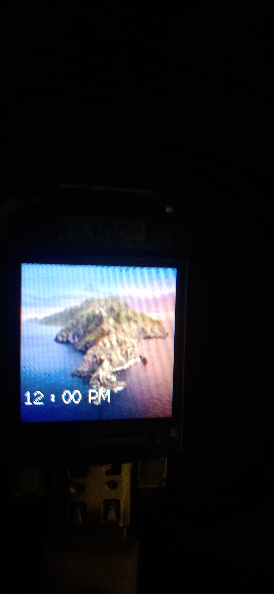
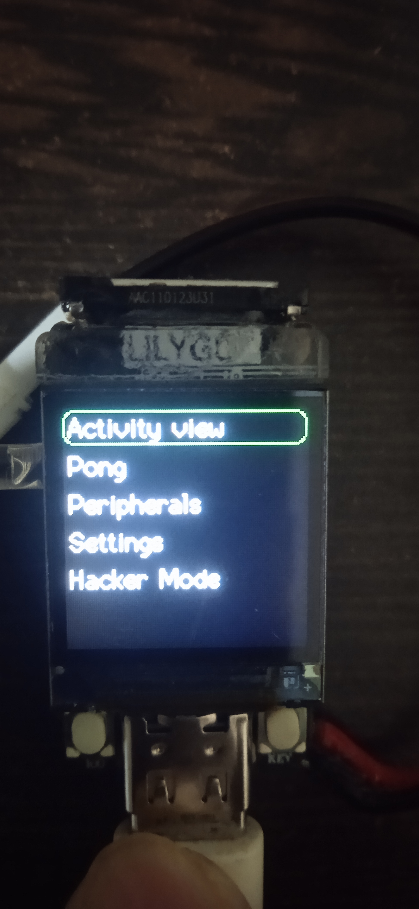
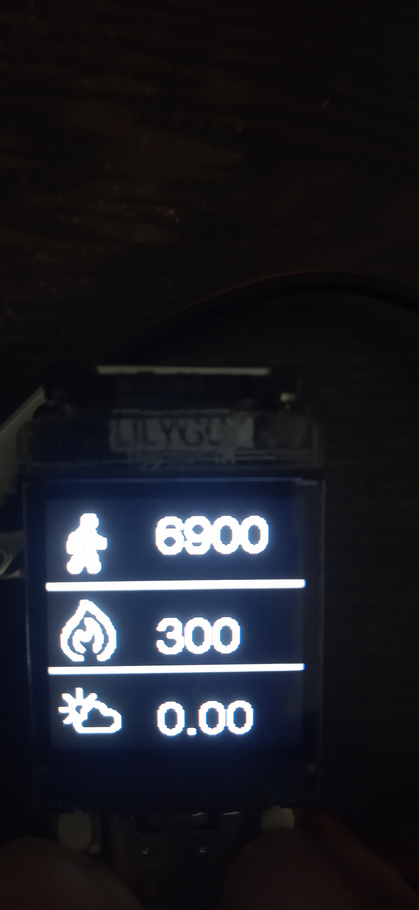
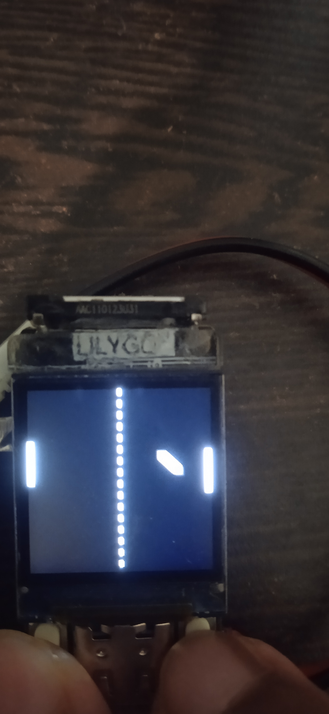
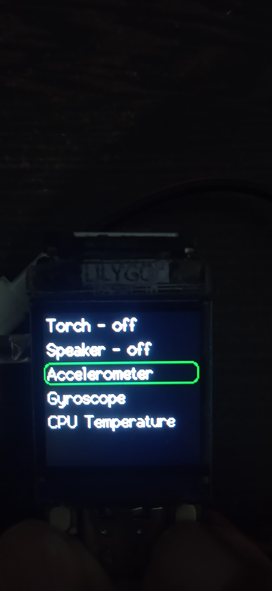
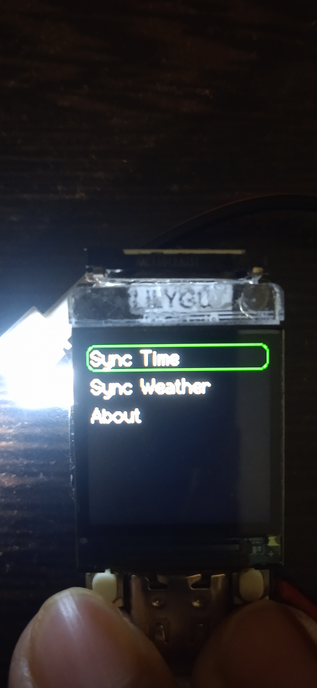
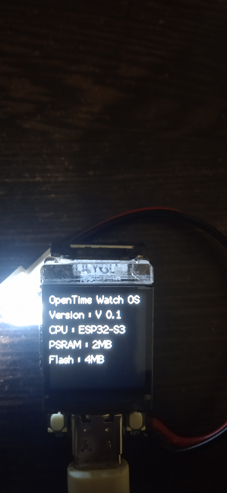
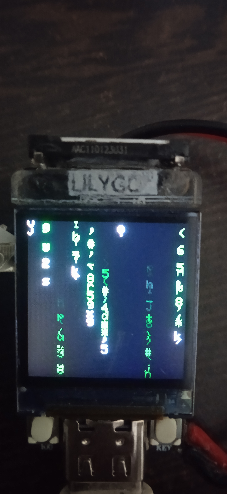

# OpenTimeWatch-OS
An open source watch OS for ESP32-S3 based development boards and watches which integrates flexibility of users customizing their watches and developers making their own apps, watch faces, widgets,etc. This OS currently supported by LILYGO TQT Pro based on ESP32-S3, we will add support for more microcontrollers and development boards in the future.

# Why need another OS for watches?
When we look at the current smart watches (especially the cheap ones) the are pretty bad, specifically the software (and also the hardware) as it is very limited in features, lack of flexibility, comes with preloaded watch faces which we cannot remove, most of the time there are no games :( ,etc. We wanted to bring a change as these cheap smartwatches are being bought by millions around the world where many consumers are dissappointed by the lack features and the microcontrollers getting cheaper day-by-day, it was our chance to make a revolution! To be honest I just wanted to make a watch with games so I won't get bored during the annual day dance practice.

# Requirements
1. LILYGO TQT Pro
2. USB-C cable
3. LED (White colour)
4. small speaker
5. MPU6050 accelerometer
6. Stemma qt connector
7. A computer with platformio or arduino ide installed

# Hardware setup
1. Solder a white coloured LED to IO33 and 34 with the ground pin being on IO34
2. Solder a speaker to ground and IO16
3. Solder a JST connector (included in the TQT Pro's box) to the battery charge pads
4. Solder a Stemma qt connector to the accelerometer
5. Connect the Stemma qt connector to the TQT Pro

# Installation
Before uploading the firmware you'll have to do some important configuration in ```src/osVariables/osVariables.cpp``` :-
1. To configure your WiFi network enter your SSID (network name) in line 40 ```const char* ssid  = "yourSSID";``` (replace
yourSSID with your network name) and in line 42 replace yourPassword with your network password ```const char* password = "yourPassword";```
2. To setup time enter the GMT offset of your region in line 46 ```const long  gmtOffset_sec = 0;``` and daylight offset
in line 48 ```const int   daylightOffset_sec = 0;``` and make sure both of them are in seconds. If you can't get the time
properly even after setting the GMT and daylight offset then you might have to change the URL of the NTP server to a URL
which is closer to your location in line 44 ```const char* ntpServer = "pool.ntp.org";```.
Below are a few common NTP server URLs:-
<br>

Area | HostName
-------:|:-------------------------
Asia | asia.pool.ntp.org
Europe | europe.pool.ntp.org
North America | north-america.pool.ntp.org
Oceania | oceania.pool.ntp.org
South America | south-america.pool.ntp.org

## For Platformio users
### TQT pro N4R2 (Flash: 4MB, PSRAM: 2MB)
Just upload the code without any changes to the ```platformio.ini``` file. It should look like this:
<br>
```
; PlatformIO Project Configuration File


[platformio]
boards_dir = ./board
;default_envs = T-QT-Pro-N8
default_envs = T-QT-Pro-N4R2
description = Open source watch OS for ESP32 based watches

;[env:T-QT-Pro-N8]
[env:T-QT-Pro-N4R2]
platform = espressif32@6.6.0
board = esp32-s3-t-qt-pro
framework = arduino
build_flags = 
	-DBOARD_HAS_PSRAM
lib_deps = 
	lennarthennigs/Button2@^2.3.3
	adafruit/Adafruit GFX Library@^1.11.11
	adafruit/Adafruit MPU6050 @ ^2.0.3
        adafruit/Adafruit Unified Sensor @ ^1.1.4
```

Note:- Platformio is currently assuming we have total 1MB of flash and not detecting the PSRAM.
### TQT pro N8 (Flash: 8MB, PSRAM: none)
You will need to do some changes in the ```platformio.ini``` file before uploading the code. It should look like this:
<br>
```
; PlatformIO Project Configuration File


[platformio]
boards_dir = ./board
default_envs = T-QT-Pro-N8
;default_envs = T-QT-Pro-N4R2
description = Open source watch OS for ESP32 based watches

[env:T-QT-Pro-N8]
;[env:T-QT-Pro-N4R2]
platform = espressif32@6.6.0
board = esp32-s3-t-qt-pro
framework = arduino
build_flags = 
;	-DBOARD_HAS_PSRAM
lib_deps = 
	lennarthennigs/Button2@^2.3.3
	adafruit/Adafruit GFX Library@^1.11.11
	adafruit/Adafruit MPU6050 @ ^2.0.3
        adafruit/Adafruit Unified Sensor @ ^1.1.4
```

## For Arduino IDE users
All of the required code is in the ```src``` directory, just rename the file ```main.cpp``` to ```main.ino``` and install the below libraries and upload the code
1. ```Button2```
2. ```TFT_eSPI``` (according to LILYGO TFT_eSPI version 2.0.14 or lower is recommended)
3. ```Adafruit GFX```
4. ```Adafruit MPU6050```
5.  ```Adafruit Unified Sensor```

Note:- also refer to the README.md at [TQT pro](https://github.com/Xinyuan-LilyGO/T-QT/tree/main?tab=readme-ov-file#quick-start) for setting up the board in arduino ide.

## Configurator Tool
The OpenTimeWatch Configurator tool is a python script which allows users to configure the Board, WiFi network and time settings before compiling and uploading the firmware to the watch. This tool does not compile and upload the code. To run the tool type 

```python otwConfigurator.py```

or

```python3 otwConfigurator.py```

in your terminal.

Note:- This tool only configures the board for the usage in PlatformIO IDE

# Features
1. Home screen with custom background
2. Activity view shows steps walked, calories burned and weather (It is just a dummy and not functionally implemented yet)
3. Pong game
4. Torch
5. Speaker
6. Accelerometer and Gyroscope
7. Time setting using WiFi
8. Multiple Watch Faces
9. Shows CPU temperature
10. Hacker Mode (ITS JUST A MATRIX EFFECT AND NOT ANYTHING RELATED TO HACKING)
11. Shows battery voltage
12. Battery Charging

# How to use?
1. If on the home screen press the menu (right) button to access the menu
2. If on the menu use the scroll (left) button to scroll down, the menu button to select an item.
3. If on any single page application press the menu button to go back to the previous menu, press the scroll button to go to the main menu and double press the menu button to access the home screen
4. While playing pong scroll button moves the paddle up and the menu button moves the paddle down

# Release Notes
1. **V0.3.3** - OpenTimeWatch Configurator tool can now configure board settings. 
2. **V0.3.2** - New OpenTimeWatch Configurator tool.
3. **V0.3.1** - otwUI bug fix, updated configuration for TQT pro N8 in ```platformio.ini``` file and better documentation.
4. **V0.3** - New UI (created using [lopaka.app](https://lopaka.app/sandbox)), multiple watch faces, Wifi support, time synchronisation, back option in menus, accelerometer support and apps and sub menus separated from the ```main.cpp``` file.
5. **V0.2.1** - Added refinements to the OS navigation, added a manual in the ```README.md``` and changed the tone of the speaker.
6. **V0.2** - A significant update compared to V0.1, as it introduced menus, pong, interaction with peripherals (torch and speaker), OS being open sourced, matrix effect, settings menu. 
7. **V0.1** - The initial release it just had a home screen and an about screen.

# What to expect in V0.4?
1. Support for our new watch hardware:- OpenTimeWatch 1
2. Weather synchronisation
3. Accent colours
4. IR transmitter support
5. Support for 3 navigation buttons
6. Screen brightness adjustment
7. Screen on-time adjustment
8. Watch endurance
9. Flappy bird clone
10. UART console support

# Can I contribute ?
Yes, you can contribute to the project by the following ways :
1. Help us add features to the project by making a PR.
2. Help us test and find bugs.
3. Give feature suggestions at this [issue](https://github.com/OpenTimeWatch-Project/OpenTimeWatch-OS/issues/1).
4. Help us test or review PRs.
Note:- PRs for grammar correction or punctuations will not be merged instead create an issue for it.

# Stargazers over time
[](https://starchart.cc/OpenTimeWatch-Project/OpenTimeWatch-OS)

# Images
## Homescreen

## Main menu

## Activity view

## Pong game

## Peripheral Menu

## Torch turned on

## Settings

## About screen

## Hacker mode (Matrix animation)

