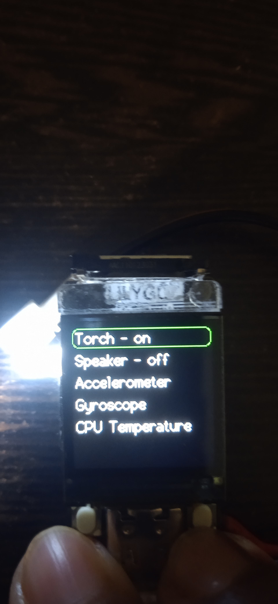

# OpenTimeWatch-OS

	
    
    
    
    
    
	

An open source watch OS for ESP32-S3 based development boards and watches which integrates flexibility of users customizing their watches and developers making their own apps, watch faces, widgets,etc. This OS currently supported by LILYGO TQT Pro based on ESP32-S3, we will add support for more microcontrollers and development boards in the future.

# Why need another OS for watches?
When we look at the current smart watches (especially the cheap ones) the are pretty bad, specifically the software (and also the hardware) as it is very limited in features, lack of flexibility, comes with preloaded watch faces which we cannot remove, most of the time there are no games :( ,etc. We wanted to bring a change as these cheap smartwatches are being bought by millions around the world where many consumers are dissappointed by the lack features and the microcontrollers getting cheaper day-by-day, it was our chance to make a revolution! To be honest I just wanted to make a watch with games so I won't get bored during the annual day dance practice.

# Features
1. Home screen with custom background
2. Activity view shows steps walked, calories burned and weather (It is just a dummy and not functionally implemented yet)
3. Pong game
4. Torch
5. Speaker
6. Accelerometer and Gyroscope
7. Time setting using WiFi
8. Multiple Watch Faces
9. Shows CPU temperature
10. Hacker Mode (ITS JUST A MATRIX EFFECT AND NOT ANYTHING RELATED TO HACKING)
11. Shows battery voltage
12. Battery Charging

# How to use?
1. If on the home screen press the menu (right) button to access the menu
2. If on the menu use the scroll (left) button to scroll down, the menu button to select an item.
3. If on any single page application press the menu button to go back to the previous menu, press the scroll button to go to the main menu and double press the menu button to access the home screen
4. While playing pong scroll button moves the paddle up and the menu button moves the paddle down

# What to expect in V0.4?
1. Support for our new watch hardware:- OpenTimeWatch 1
2. Weather synchronisation
3. Accent colours
4. IR transmitter support
5. Support for 3 navigation buttons
6. Screen brightness adjustment
7. Screen on-time adjustment
8. Watch endurance
9. Flappy bird clone
10. UART console support

# Stargazers over time

# Images
## Homescreen

## Main menu

## Activity view

## Pong game

## Peripheral Menu

## Torch turned on

## Settings

## About screen

## Hacker mode (Matrix animation)

